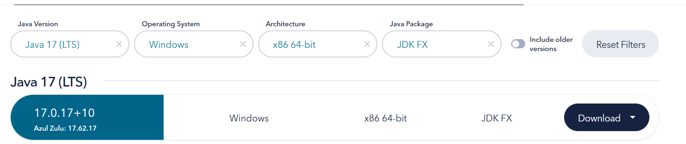
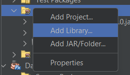
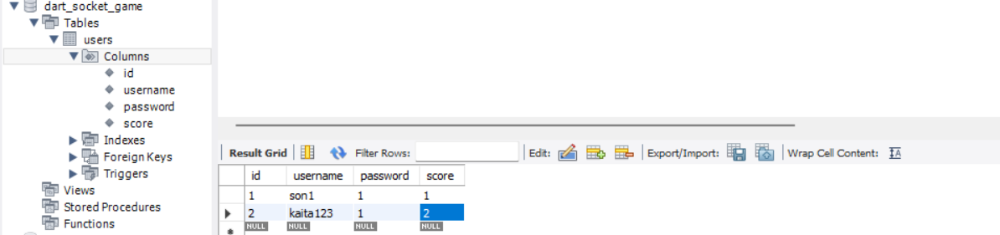
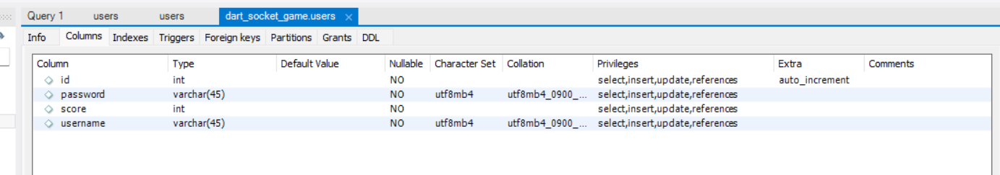
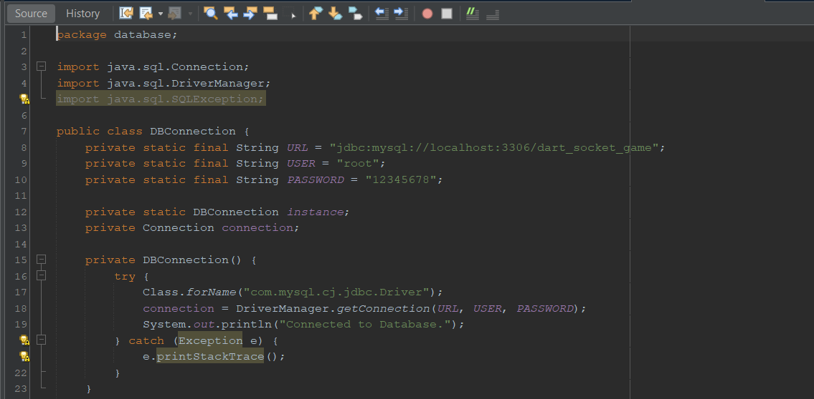

# HƯỚNG DẪN SETUP MÔI TRƯỜNG:

1. Netbean:
   1. Thư viện:
      1. 
      2. Có thể tải luôn ở file Drive: `https://drive.google.com/drive/folders/1Unyrvpwn3IzNGO_zoOBSkXxevbMlOlKw?usp=sharing`
      3. ZuluFX, JDK 17
         1. https://www.azul.com/downloads/?version=java-17-lts&os=windows&architecture=x86-64-bit&package=jdk-fx#zulu
         2. 
      4. My SQL J
   2. Cách cài đặt:
      1. Vào Project, chọn Add Jar:
         1. 
      2. Với ZULU thì phải thêm nó vào Platform:
         1. `http://youtube.com/watch?v=WQZpIZeHzLM&t=59s`
2. Database:
   1. Dùng Mysql (DBMS thì XAMPP hoặc Workbench đều được)
   2. Tạo DB dart_socket_game với bảng Users với các cột sau:
      1. 
      2. 
   3. Đổi mkhau - tkhoanr db trong code (dbconnection.java)
      1. 
3. KHởi chạy:
   1. Nếu muốn Test trên 1 máy:
      1. Bật Server trước => Bật 2 Client, mỗi Client đăng nhập 1 tài khoản
   2. Test trên nhiều máy:
      1. Cài đặt Radmin VPN, 2 máy vào chung 1 mạng.
      2. 1 máy bật Server, nhiều máy bật Client
